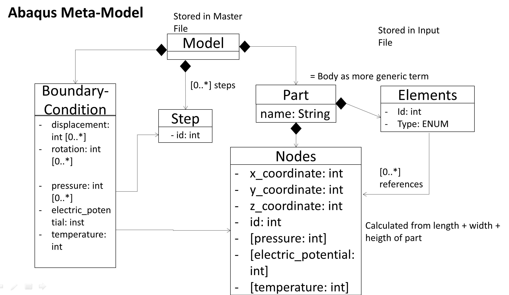
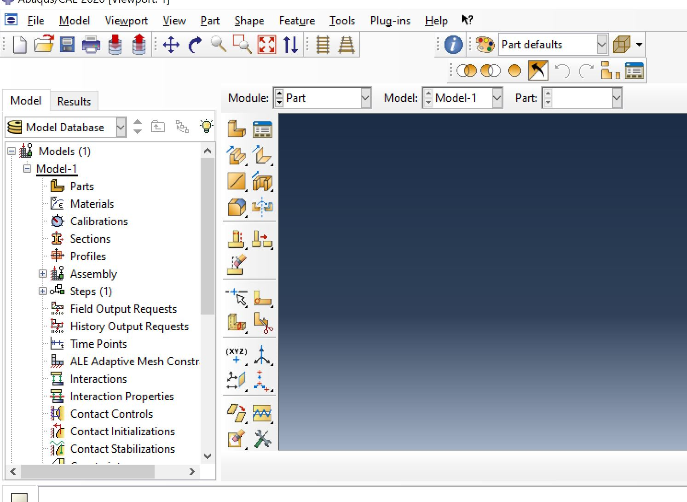
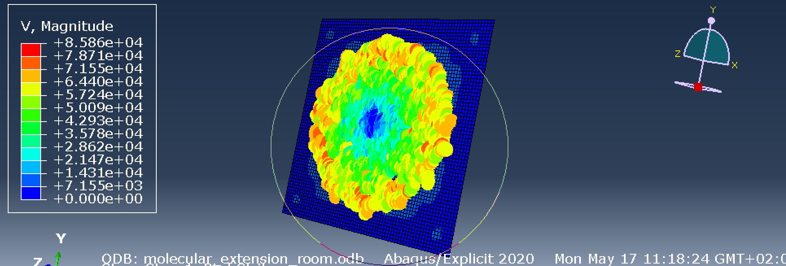
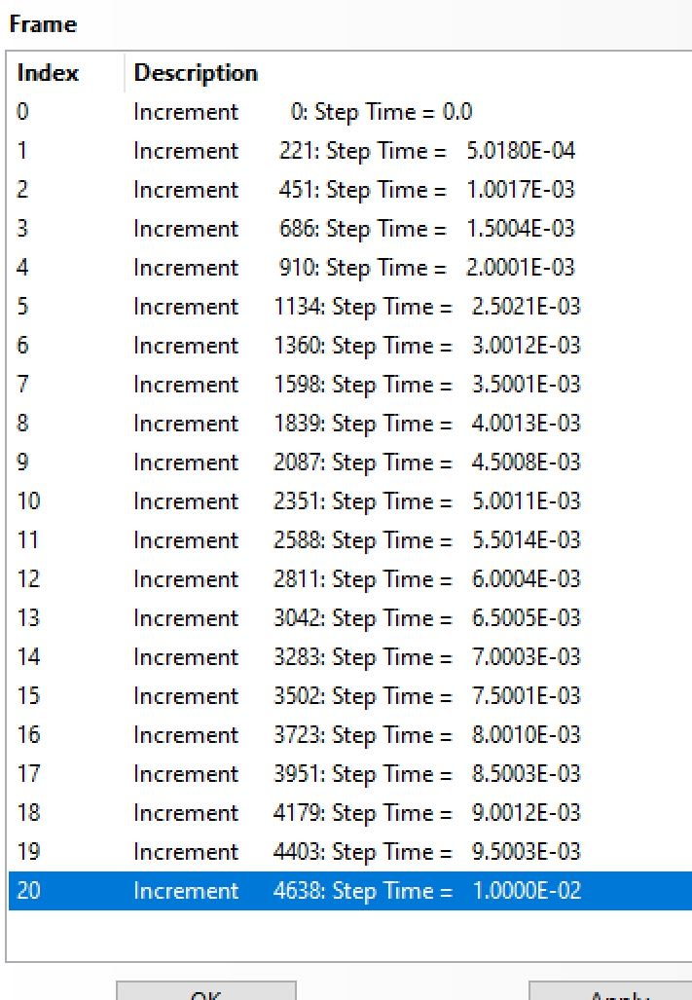

# Physical Modelling of CO2 on Abaqus 

In this project the physical model is used for modelling the CO2 molecules in the air. The benefits of using a physical model are that the air quality can be visualized in the simulation. This is done via visualizing the movement of the particles in the air with color coding in order to show the dangerous and safe levels in a dynamic way.

From a scientific point of view physical modeling has the advantage of showing how the variable that is being analysed is behaving. This analysis includes both the structure (properties) and the functions of the variable. Therefore extracting a physical model from a digital twin can help understand the real model better and give a better overall overview of the model.

## Introduction to the Importance and Need of Physical Modeling

Computational modelling is a very good time and money sparing tool which is a method for non-

destructive investigation. Most of all the analysed system can be put into complex scenarios which

wouldn’t be possible in real life. 

There are many biomechatronic applications where the virtual model would be very useful. One

such application would definitely be in simulating the fluid flow in the Room and exchange between

people and analysing the FSI (velocity changes) in order to understand the air quality of the room.

Another application would be placing raspberries in different areas of the room and analysing

the geometrical changes to the CO2 particles. This could be in context of FSI when placing a

raspberry or in another context.

## Creating the Physical Model in Abaqus
Input files can be created in two ways on Abaqus either by scripting the file with keywords on an editor (these would be .inp files which can be seen on the seperate document of scripts) or by a graphical interface manually. 

If created manually the graphical interface must be used which has its benefits for simple usage but the disadvantage of having fixed defined geometries. This is an important part of the input files. 

### Modelling the shape of the room
 

The walls of the room (the nodes) are deformed by boundary conditions. As the boundary

conditions were considered, the material was not important and therefore also not included in the

settings of Abaqus.

The element shapes consisted of 1595 rows and 3 columns. The rows represented the number

of elements and and the columns the respective nodes belonging to each element.

These raw data were then translated into an input file for Abaqus. This was done by writing a

python script on jupyter.

### Modeling the fluid flow

For the fluid flow, SPH was considered on Abaqus. Python Scripting was used

to read in the input data for the geometry of the time states.

On Abaqus the simulation was created as a Dynamic Explicit Step with the units: mm,t and s.

All of the details on how each geometry was created on the FE program of Abaqus will be discussed

in the following sections.

## Model Driven Engineering Techniques

### Meta-Model of Abaqus

### Additions needed in the Digital to create the Abaqus model
you can auto-generate the abaqus model using some template files that are adapted based on the digital twin model

**[DL] We can structure this section in the following way: first, describe the meta-model of abaqus. Then, describe what additions we need in the Digital Twin to create the Abaqus model. Then, describe what would be benefits of making this (you can auto-generate the abaqus model using some template files that are adapted based on the digital twin model).**

### Modelling the CO2 source(s) in the room

The geometries of the source(s) were taken from the paper of Caballero. The dynamic behaviour

was modelled such that they were fixed in their positions (the setting on Abaqus was "ENCASTRE").

Since the SPH formulation in Abaqus lacks periodic boundary conditions, the tubes were ex-

tended long enough to accommodate the in- outflow of particles for 2 full cycles. The tubular

structure had a diameter of 36.8mm and length started first with 20mm which was then extended

depending on the need for the fluid flow.In the end the for better modelling of the CO2

sources, the hollow shapes could be extended.

### Modelling the Fluid Flow (Air Particle Properties-SPH particles)

The SPH modelling method is a meshless Lagrangian numerical technique that is modelled by an

equation of state on Abaqus(which is a research engineered data). It is a computational model to

model the fluid for simulating fluid flow. Through such a method, problems involving large mesh

distortions can be solved with high accuracy.

SPH is usually chosen over the modelling needs in which traditional methods (FEM, FDM) fail

or are inefficient. In extreme fluid flow where CFD (mesh or grid-based) cannot cope (free surface).

The novelty of SPH lies in the smooth interpolation and differentiation within an irregular grid of

moving macroscopic particles. Because nodal connectivity is not fixed; severe element distortion is

avoided; hence the formulation allows for very high strain gradients.

The way SPH methods work is by dividing fluid into discrete elements referred to as PC3D.

These SPH discrete elements (also considered as particles) have spatial distance known as smoothing

length.

The conservation of mass, linear, momentum and energy are exactly satisfied. SPH analysis

is an abaqus/explicit capability implemented for three-dimensional models. Initial and boundary

conditions can be specified as for any lagrangian model. Concentrated nodal loads can be applied

in the usual way, but the only distributed load type allowed is gravity. The only limitation is that

particle elements are not currently supported in Abaqus CAE.

### Settings on Abaqus for Air Particles

The particle generator of air was used on Abaqus with the following incompressible characteristics

of air particles:

newtonian fluid of density:

ρ = 1056kg/m3

dynamic viscosity:

µDyn = 0.0035Pa ∗ s

A general procedure for setting up SPH particles on Abaqus follows this order:

1. Create a part for the SPH particles.
2. Create an auxiliary continuum solid mesh with as much regularity as possible to reduce inaccuracies.
3. Create a node set that includes all the nodes of the auxiliary mesh.
4. Create dummy mass elements at the nodes of the auxiliary mesh.
5. Create the material.
6. Instance the SPH part.
7. Apply the initial and boundary conditions.
8. Request field and history output.
9. Write input file.
10. Modify the input file in a text editor:remove the auxiliary continuum solid mesh file.
11. Change the mass elements to PC3D particle elements.
12. Remove the dummy \*MASS option from the file and in its place use the \*SOLID SECTION
option to specify the properties of the particle elements.
13. Define a node-based surface that includes all the SPH particles.
14. Define contact interactions between the node-based particle surface and other surfaces in the
model.

In order to model the fluid flow the file was generated with SPH particles moving in and out
of the source. The nodes start from 2224 and go to 175069 nodes (in total 172845 nodes). The
total number of elements were 175068-3055=172013 elements. For the element set the solid section
keyword had to be implemented. 

### Dynamic Fluid Flow in and out of the CO2 on Abaqus

The dynamic movements of the virtual room gain importance when fluid flow is happening. In
other words air circulation wouldn’t be possible if there were no time states for a full cycle.
Therefore the master input file for Abaqus, the filling was written with the following scripting
The end and start values were taken as displacement values in the Abaqus input file as a displacement for the in the input file .
And for the end state, the following script was written on the master file for Abaqus.

### Limitations of the SPH Particles on Abaqus:

Unfortunately if the nodes are not placed in a regular cubic arrangement the initial mass is distributed inexactly. This happens particularly at the free surfaces. Additionally surface loads cannot be specified on PC3D elements. Another limitation is that mixing nodes with dissimilar materials cannot be modelled. However, apart from these limitations, the using SPH particles was a suitable choice for the modelling of the air circulation inside of the room.

### The Complete Model of the Virtual Room

In order to complete the entire model of the virtual room, all of the input files were included in the

master input file. The next subsections will discuss which complete model

of the virtual room had the best fit.

Additionally the surface and surface sections for the elements were also defined in the master
file. It was also important to define the amplitude values for the displacement values which were
then also scripted right below the surface and surface sections. 

### Virtual Room with Short Sources

The initial model of the virtual room with the geometries taken from the Caballero paper resulted

in some stability issues and less control of the movements of the air particles on Abaqus which is the

reason the model was then modified into a virtual room model with longer sources (see following

subsection).

The odB file (output file) of the scripted input file by blending out the outer

layer and having a direct view on the particles.

### Building Parts (different sources) on Abaqus

In order to renumber the nodes of the pacemaker, the settings on was chosen. This

setting could be reached via editing the mesh on Abaqus.

 Renumbering nodes of the pacemaker to include in the master input file

Since it was not enough to only renumber the nodes but also necessary to renumber the elements,

the following renumbering settings on had to be additionally applied.

 Renumbering elements of the pacemaker to include in the master input file

Afterwards it was possible to mesh the source with quadrilateral R3D4 elements, as seen in
model of Source

Overall building a FE model of a virtual LV on Abaqus is possible and easy to handle if the nodes,

elements and time states of the position of the nodes as displacements are given from accurate

measurements. 

